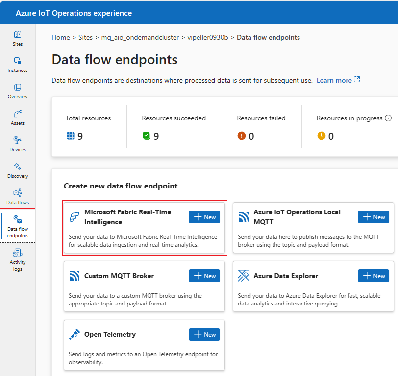
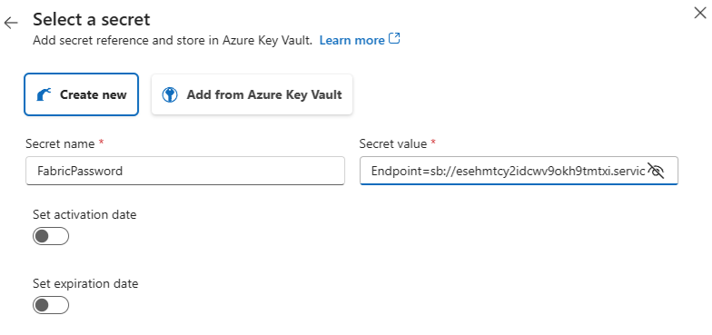
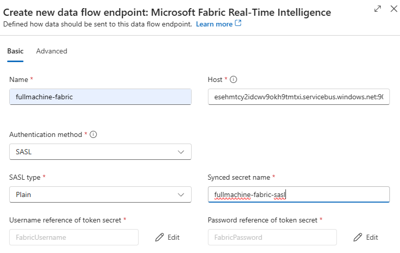

### Create Dataflow

Creating a **Dataflow** requires the **endpoint credentials** collected during the [Eventstream setup](./CREATE_EVENTSTREAM.md). These credentials establish the secure bridge between **Azure IoT Operations (AIO)** and **Fabric**.

---

#### 1. Create Fabric Endpoint

1. In the **Azure IoT Operations Experience** portal, navigate to **Data flow endpoints** and click **New**:

   

2. On the setup screen, copy the **Bootstrap server** value from the Fabric Kafka credentials pane into the **Host name** field.
   Ensure the **Authentication method** and **SASL type** match what is shown in Fabric:

   

---

#### 2. Configure Authentication

Authentication requires setting up **Username** and **Password** references in a **Keystore**:

* **Username**: Add a reference with the value set to **`$ConnectionString`**.

  

* **Password**: Add a reference with the value set to the **Connection string – primary key** copied from the Fabric Kafka credentials pane.

  

---

#### 3. Apply and Save Endpoint

1. Assign a **name** to the secret.
2. Click **Apply** to create the Fabric endpoint.

The new endpoint will now appear under **Data flow endpoints** and be available for selection when creating the Dataflow.

---

#### 4. Create Dataflow

1. In the portal, go to the **Data flows** pane and click **Create data flow**:

   

---

#### 5. Select Destination

1. In the wizard, click **Select destination**.

2. Choose the Fabric endpoint created earlier, then click **Proceed**:

   

3. On the next screen, copy the **Topic name** from the Fabric Kafka credentials pane into the **Topic** field:

   

4. Press **Apply** to confirm the destination.

