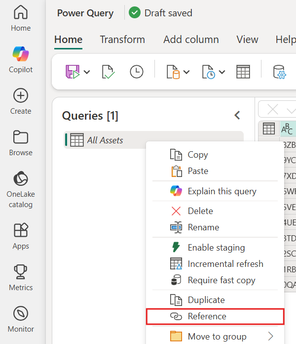

# Ingest Asset Metadata from ADR to Microsoft Fabric 
Ingest asset metadata stored in Azure Device Registry (ADR) into a Lakehouse table within Microsoft Fabric. This metadata provides essential context, such as version, manufacturer, location, and custom attributes, that can be mapped to entities in Ontology. When combined with telemetry data, it enables more accurate modeling, monitoring, and analysis of your assets and operations. 

## 1. Create a Dataflow Gen2  

1. Go to your Fabric enabled workspace
2 .Click **New item** and select **Dataflow Gen2** in the create menu.
    > For more information, see [Differences between Dataflow Gen1 and Dataflow Gen2 - Microsoft Fabric | Microsoft Learn](https://learn.microsoft.com/en-us/fabric/data-factory/dataflows-gen2-overview)
3. Enter a **name** for the Dataflow Gen 2 and optionally enable **CI/CD and Git integration** for advanced scheduling and version control

## 2. Configure the Azure Device Registry (ADR) Connector 

1. Click on **Get Data** or **Get data from another source**.
2. In **Choose a data source**, search for the **Azure Device Registry (preview)** connector and click on it. 
    > For more information, see: [Azure Device Registry connector - Power Query | Microsoft Learn](https://learn.microsoft.com/en-us/power-query/connectors/azure-device-registry)
3. In **Connect to data source**, select a scope and fill in any optional or advanced fields
   
    

|Field|Description |
|-----|------------|
|Scope |Choose whether to retrieve data from all Azure subscriptions in your tenant or from specific subscriptions. |
|Subscription ID(s)| Applies **only** when scope is set to Subscription. By default, all subscriptions are included. Enter one or more Subscription IDs, separated by commas, to narrow the scope to specific subscriptions. |
|ADR Namespace(s) | Applies **only** when scope is set to Subscription. By default, the namespace filter applies across all subscriptions if no Subscription IDs are provided. Enter one or more ADR namespaces, separated by commas, to filter results. |
|Custom Attributes|Enter a comma-separated list of up to 100 custom attribute names to include as separate columns. A column named "attributes" is always included and contains all custom attributes in JSON format, even if they aren't listed in this field.|

4. **Sign in** with your organizational account
5. When you're successfully signed in, select **Next**
6. In **Choose data**, select the resource types you require (either namespace assets (preview), devices (preview) or both) and then select **Create**

## 3. Create Type-specific Tables 
To successfully import asset metadata into Ontology, the metadata must be scoped to specific asset types. This is because in Ontology, each metadata table corresponds to a distinct entity type defined in the asset definition. One way to do this is by using the Reference feature in Dataflow Gen 2: 

1. In your Dataflow Gen2, right-click the metadata table and select **Reference**
   
    
2. In the new reference table:
   a. Locate the **AssetTypeRef** column
   b. Filter to a single asset type using the dropdown next to the column name.

    ![Filtering Reference Table(./images/adr_connector_filtering_reference_table.png "Filtering Reference Table")
4. (Optional) Rename the table with a friendly name to reflect the asset type
5. Repeat for each asset type you want to map in Ontology

## 4. Send data to a Lakehouse Table 

1. Click **+** next to **Data destination** at the bottom-right of the Dataflow page
2. Select **Lakehouse**.
4. In the **Connect to destination** menu, verify you're signed in with your organizational account. If not, sign in and click **Next**.
5. In **Choose destination target**: 
  a.  Select **Create new table** at the top left 
  b. Choose your **workspace folder**
  c. Select your **Lakehouse**
  d. Name your **table** (e.g., Namespace Asset Metadata) 
  e. Click **Next **
6. In **Choose destination settings**:
   a. Keep **Use automatic settings** toggled on
   b. Click **Save settings**

## 5. Run and Verify the Dataflow Gen2
1. Click **Save and Run**
2. Navigate to your **workspace**
3. Click the **three dots (...)** next to your Dataflow Gen2
4. Select **Recent runs** to check status 
5. Wait ~1 minute and refresh the page
6. Navigate to your Lakehouse to view your tables. If they don’t appear, click the **Refresh** button or reload the page

## 6. (Optional) Schedule Recurring Runs 
Use the built-in **Dataflow Gen2 scheduler** to automate and schedule recurring dataflow runs. This ensures your data stays current and reflects the latest state of the asset metadata. To set it up: 

1. In your workspace, locate the Dataflow Gen2
2. Locate the **Dataflow Gen2** you created
3. Click the **three dots (⋯)** next to the dataflow name
4. Select **Schedule**
5. Configure the refresh frequency and time 
