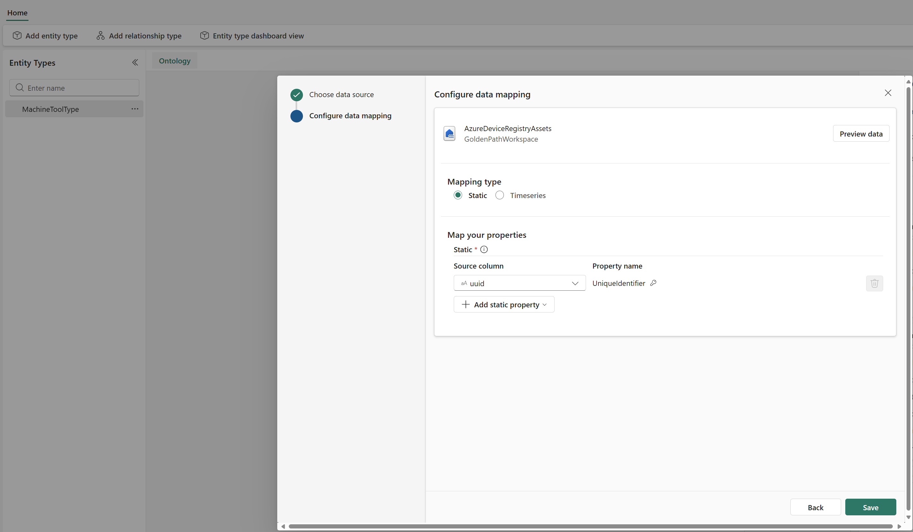

# Map Azure Device Registry Assets to Entities in Ontology
For more information, see: [Add Entity Types and Map Data](https://learn.microsoft.com/en-us/fabric/real-time-intelligence/digital-twin-builder/tutorial-2-add-entities-map-data)
1. Select your entity type on the canvas or in the entity type list pane to open the **Entity configuration pane**.
2. In the pane, go to the **Mapping** tab. Select **Add data** to create a new mapping.
3. Choose your workspace and the lakehouse table with the asset metadata from Azure Device Registry as your data source.
4. Next, select **Static** as the **Mapping type** of your data.
5. Under **Mapped properties** select the ```uuid``` column as the **UniqueIdentifier** of the data and select the **Add static property** button to map other relevant properties from your source table on your entity type.
   
   
7. Select **Save** to save your mapping configuration.
9. Go to the **Scheduling** tab to run your mapping job. Under the name of your mapping job, select Run.
10. Check the status of your mapping job in the **Manage operations** tab. Wait for the status to say **Completed** before proceeding to the next section (you might need to refresh the content a few times).
